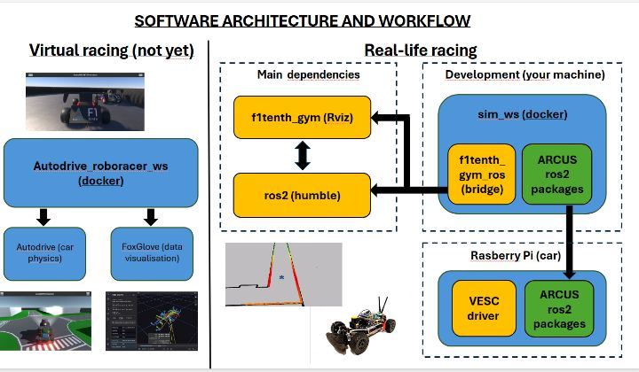

# SETTING UP THE ENVIRONNEMENT 

***IMPORTANT: THIS DOCUMENTATION IS A WORK IN PROGRESS. IF YOU SEE ANY ERRORS, UNCLEAR STEPS OR OUTDATED INFO, PLEASE NOTICE US OR UPDATE IT***

Before you start setting up, it is important that you installed and set up **UBUNTU DOC LINK 20.04** and **ROS DOC LINK**. 

 
The picture above gives a brief visual overview of the software architecture and different tools we use.
First of all, it is important to note that we do **virtual AND real-life racing**. Therefore, distinct setup-up are needed for each and you might want to only set-up the environment that you're going to work with.
They are **4 main repositories** being used in the project. One is for virtual racing : *Autodrive_roboracer_ws*. The three other are used for real-life racing: *f1tenth_gym_ros*, *arcus* and *VESC*.

# 1. Virtual racing
Our team is not ready yet to compete in virtual roboracer competition. The setup is still a work in progress and documentation will soon come.
# 2. Real-life racing
For real-life racing,they are 3 important repository that you will find in the **Robotiques_udes github**. On top of that, you will need to clone the **f1tenth_gym.** Don't worry, the documentation will walk you through the set up step by step.
## Overview 
The workflow to code the car for real-life racing revolves around 3 important aspects:
- **Development**
- **Simulation**
- **Uploading the code in the car**

## 2.1 Installing the f1tenth_gym
The **f1tenth_gym** is a simulation tool, based on **Rviz**, developed by the f1tenth program (now called roboracer) to help students with simulation.
- Clone the repo:
```bash
git clone https://github.com/f1tenth/f1tenth_gym
cd f1tenth_gym && pip3 install -e . 
```

## 2.2 Creating your workspace
Your workspace is a local folder called **sim_ws** where you'll be working from.
- Create the folder:
```bash
cd $HOME/sim_ws/src
```
- Clone the **f1tenth_gym_ros** repo. This repo is a bridge, allowing communication between the **f1tenth_gym** and **ROS2**:
```bash
git clone https://github.com/f1tenth/f1tenth_gym_ros
```
- Clone the ***ARCUS*** repo. This repo is our codebase and contains all our ROS2 packages:
```bash 
git clone https://github.com/Gabduf/ARCUS_ros_pkg_example.git
```
**METTRE LA REPO ARCUS QUAND ON LES SPLIT (exemple en attendant). On va vouloir avoir une repo qui a juste nos package ros et rien d'autre.**

## 2.3 Building and setting up the simulation
